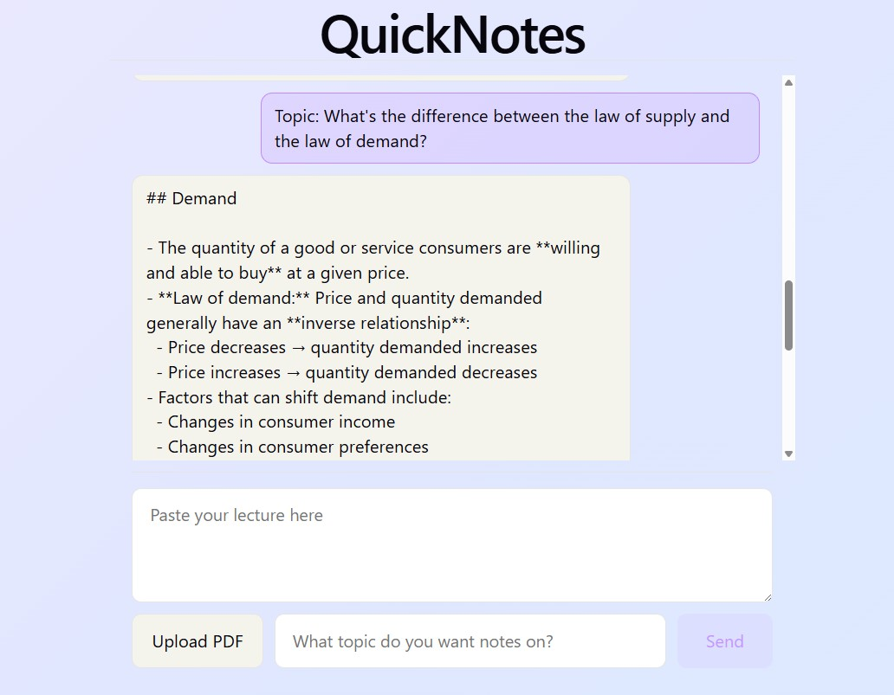
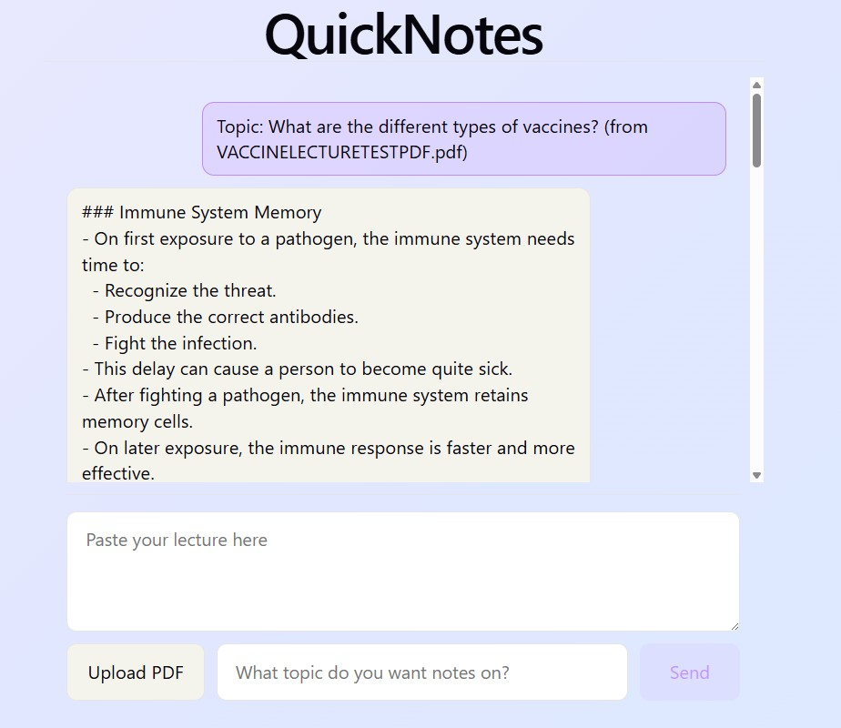

# QuickNotes

An AI-powered notes generator. Paste in a lecture transcript or upload a PDF, tell it what topic you want notes on, and it retrieves the relevant sections and generates clean, structured notes — instead of you scrolling through a long document looking for one specific part.

---

## Screenshots

### Generating notes from pasted text


### Generating notes from an uploaded PDF


---

## Features

- Generate structured, topic-specific notes from long documents using natural-language topic requests
- Paste text directly or upload a PDF — both are supported through the same pipeline
- RAG pipeline: documents are chunked, embedded, and semantically searched to find only the relevant context before generating notes
- Automatic PDF text extraction, so users don't have to manually copy and paste from PDF files
- No database required — each request is processed independently, with no persistent user data

---

## Tech Stack

**Backend**
- FastAPI
- Python
- OpenAI API (embeddings + generation)
- ChromaDB (vector storage and semantic search)
- LangChain (text splitting/chunking)
- pypdf (PDF text extraction)

**Frontend**
- React + Vite

---

## Project Structure
backend/
  main.py          – FastAPI app, endpoints, and RAG pipeline
  requirements.txt – Python dependencies
frontend/
  src/
    App.jsx        – Main chat-style UI and state management
    App.css        – Styling for the chat interface
    api.js         – Handles requests to the backend
    main.jsx       – React app entry point

---

## How to Run Locally

### Backend

1. From the `backend/` folder, create and activate a virtual environment:

```bash
python3 -m venv venv
source venv/bin/activate   # macOS/Linux
.\venv\Scripts\activate    # Windows
```

2. Install dependencies:

```bash
pip install -r requirements.txt
```

3. Create a `.env` file in `backend/` with your OpenAI API key:

```bash
OPENAI_API_KEY=<your OpenAI API key from platform.openai.com>
```

4. Run the server:

```bash
uvicorn main:app --reload
```

5. Swagger docs: http://127.0.0.1:8000/docs

### Frontend

1. From the `frontend/` folder:

```bash
npm install
npm run dev
```

2. App runs at http://localhost:5173 (or the port shown in your terminal)

---

## Usage

1. Paste a lecture or document into the text box, OR click "Upload PDF" to select a file instead
2. Type the topic you want notes on
3. Click Send — the app retrieves the relevant sections and generates structured notes based on your topic

---

## Notes

This is an early-stage project — retrieval quality and note formatting are still being refined, and PDF extraction currently assumes native, text-based PDFs (not scanned images).
